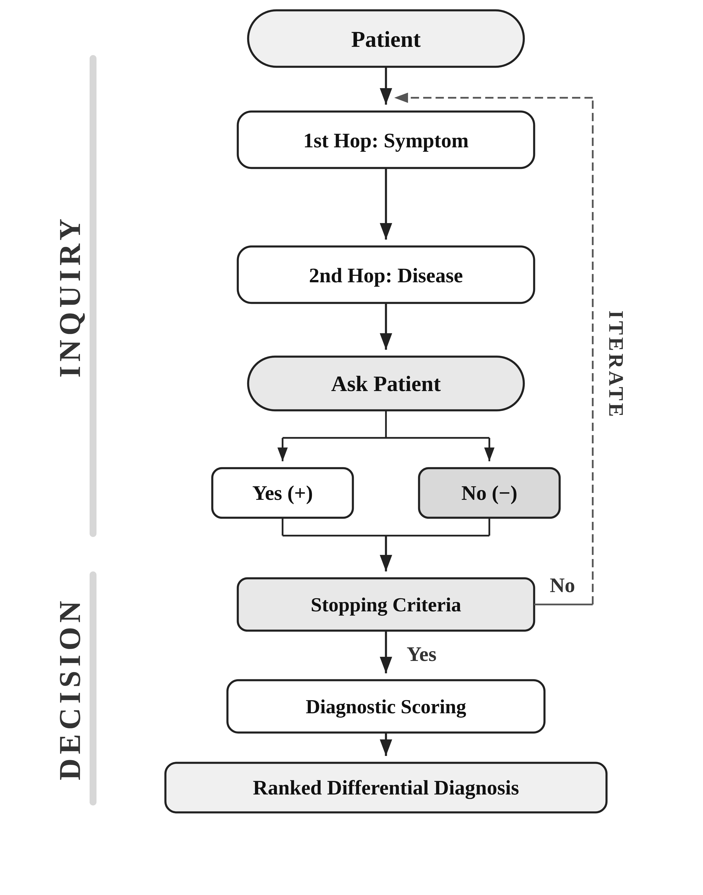

# 학습 없는 지식그래프 탐색을 통한 추적 가능한 자동 감별 진단

## Title Page

**제목**: 학습 없는 지식그래프 탐색을 통한 추적 가능한 자동 감별 진단

**영문 제목**: Traceable automatic differential diagnosis via training-free knowledge graph exploration

**Running Head**: Traceable KG Differential Diagnosis

**저자**: [저자명]1

**소속**:
1[소속기관]

**교신저자**:
- 성명: [교신저자명]
- E-mail: [이메일]

---

## Abstract

**목적**: 강화학습 또는 대형언어모델 기반의 기존 자동 감별 진단 시스템은 학습 데이터에 의존하며 의사결정 과정이 불투명하여 해석가능성에 한계가 있다. 본 연구는 추적 가능한 진단 추론을 제공하는 지식그래프 탐색 기반의 비학습형(training-free) 감별 진단 방법론을 제안한다.

**방법**: 49개 질환과 223개 증상을 UMLS(Unified Medical Language System) 개념에 매핑하여 지식그래프를 구축하였다. 시스템은 2-hop 그래프 탐색을 통해 반복적으로 증상을 질문하고 후보 질환의 순위를 산출한다. DDXPlus 벤치마크(134,529건 테스트셋)에서 증상 탐색 전략, 종료 조건, 스코어링 함수의 200가지 조합을 평가하였다. 요인 분석을 통해 진단 성능을 결정하는 지배적 설계 요인을 규명하였다.

**결과**: 최적 설정(부정 증상 임계값 필터, Top-3 안정성 종료, 증거 비율 스코어링)은 평균 23.1회 질문으로 GTPA@1 91.05%를 달성하여, 강화학습 기반 접근법(75.39%)을 15.66 percentage point 상회하였다. 부정 증상 기반 가설 소거가 지배적 성능 요인으로서 증상 탐색 효율성 분산의 94.67%를 설명하였다. 모든 진단 경로는 그래프 궤적으로 완전히 추적 가능하다.

**결론**: 비학습형 2-hop 지식그래프 탐색은 재현성과 검증가능성을 제공하면서 경쟁력 있는 진단 정확도를 달성하였다. 200가지 설계 조합의 체계적 비교를 통해 부정 증상에 의한 가설 소거를 핵심 메커니즘으로 규명하였으며, 이는 학습 기반 접근법에 대한 투명한 대안을 제시한다.

**Keywords**: Differential Diagnosis, Unified Medical Language System, Biological Ontologies, Knowledge Bases, Algorithms

---

## 1. 서론

자동 감별 진단 시스템은 환자와 상호작용하며 증상을 수집하고, 후보 질환의 순위 목록을 점진적으로 정제한다 [1]. 이는 가설 생성, 증거 수집, 가설 검증이라는 임상의의 반복적 진단 과정을 자동화하는 것을 목표로 한다 [2].

DDXPlus 벤치마크에서 강화학습 기반 접근법은 GTPA@1 75.39%를 달성하였으나 [1], 학습 데이터에 의존하며 의사결정 과정이 불투명하다. 대형언어모델(LLM) 기반 접근법은 GTPA@1 86%를 보고하였으나, 저자들이 인정한 바와 같이 부정확한 진단 및 환각(hallucination)의 위험과 모델 선택 및 지연 시간의 실용적 제약이 존재한다 [3]. 이러한 학습 기반 모델들은 추론 과정의 투명성이 부족하여 의료 AI 도입의 해석가능성 요구 [2, 3]와 EU AI Act(2024)의 설명가능성 법적 요건 [4]을 충족하기 어렵다.

지식그래프(KG)는 이러한 블랙박스 모델의 대안을 제공한다. KG는 증상-질환 관계를 명시적이고 기호적(symbolic)인 형태로 저장한다. UMLS는 200개 이상의 의학 어휘 체계를 통합하고 400만 개 이상의 의료 개념에 고유 식별자(CUI)를 부여하여 표준화된 의료 지식을 제공한다 [5]. KG 기반 추론은 진단 근거를 그래프 탐색 경로로 직접 제시할 수 있어 해석가능성, 재현성, 검증가능성을 제공한다 [6, 7]. KG는 UMLS 임상 개념 관계를 활용한 질환 예측 [8], 지식그래프 구축 기반 처방 추천 [9] 등 의료 분야에 적용되어 왔다.

자동 감별 진단 연구는 세 가지 범주로 분류된다. 학습 기반 접근법에서 강화학습 에이전트 AARLC는 GTPA@1 75.39%, 지도학습 방법 BASD는 67.71%를 DDXPlus에서 보고하였다 [1]. 이러한 접근법은 학습 데이터에 의존하며 의사결정 과정이 모델 내부에 내재되어 해석가능성이 제한된다 [10]. 베이지안 네트워크 기반 시스템은 확률적 추론의 투명성을 제공하나 조건부 확률 테이블 구성에 전문가 지식 또는 학습 데이터가 필요하다 [11]. LLM 기반 접근법에서 GPT-4o 기반 모듈형 에이전트 프레임워크 MEDDxAgent는 DDXPlus에서 GTPA@1 86%를 보고하였으나 [3], 환각 위험 [12], API 비용, 재현성 제약이 지적된다 [3]. KG 기반 접근법에서 증상-질환 관계를 명시적으로 표현하여 해석가능성과 재현성을 제공하나 [6, 7], 기존 연구는 주로 진단 추론에 집중하였으며 능동적 증상 수집과 체계적 종료 조건 비교를 통합한 프레임워크는 보고되지 않았다.

본 연구는 증상-질환 관계에 대한 2-hop KG 탐색만으로 모델 학습 없이 자동 감별 진단을 수행하는 방법론 GraphTrace를 제안한다. UMLS 기반 2-hop KG 탐색만으로 증상 수집부터 진단까지의 전체 파이프라인을 구성하고, 200가지 설계 조합의 체계적 비교를 수행한다는 점에서 기존 연구와 차별화된다. 연구 질문은 다음과 같다: (1) 학습 과정을 배제한 2-hop KG 탐색만으로 기존 학습 기반 모델에 상응하는 진단 정확도를 달성할 수 있는가? (2) 증상 탐색 전략의 어떤 설계 요인이 전체 탐색 성능을 결정하는가? (3) 종료 조건과 스코어링 함수의 어떤 조합이 정확도와 효율성 간 최적 균형을 달성하는가?

---

## 2. 방법

### 2.1 시스템 개요

시스템은 세 가지 구성요소로 이루어진다: (1) 증상 탐색, 다음에 질문할 증상 선택; (2) 종료 조건, 질문 중단 시점 결정; (3) 진단 스코어링, 수집된 증상으로 질환 순위 산출. 시스템은 학습 단계 없이 작동하며, 모든 지식은 UMLS 지식그래프의 구조적 정보에서 획득한다(Figure 1).

**Figure 1.** 2-hop 지식그래프 탐색 시스템 개요.
탐색 단계에서, 확인된 증상은 지식그래프로부터 후보 질환을 검색하고(1st hop), 이 후보 질환들은 환자에게 다음으로 질문할 증상을 생성한다(2nd hop). Yes(+) 응답은 확인 증상을, No(-) 응답은 부정 증상을 축적한다. 상위 3개 진단 순위가 연속 *n*턴 동안 변동 없이 유지될 때까지 이 순환이 반복된다(점선). 판단 단계에서, 증거 비율 스코어링 함수가 축적된 확인 및 부정 증상을 기반으로 모든 후보 질환의 순위를 산출하여 최종 감별 진단 목록을 생성한다.

### 2.2 지식그래프 구축

UMLS 증상-질환 관계 데이터를 활용하여 지식그래프를 구축하였다. 그래프는 증상 노드와 질환 노드로 구성되며, INDICATES(증상이 질환을 시사함) 관계로 연결된다. 각 노드는 UMLS CUI를 가지며, 그래프는 Neo4j에 저장하였다.

DDXPlus 평가를 위해 49개 질환과 223개 evidence를 UMLS CUI에 매핑하였다. "Training-free"는 DDXPlus 데이터로부터 모델 파라미터를 학습하지 않는다는 의미이며, CUI 매핑은 지식베이스 구축 과정에 해당한다.

질환은 DDXPlus가 제공하는 ICD-10 코드를 활용하여 매핑하였다(100% 매핑률). Evidence는 DDXPlus의 영어 질문 필드에서 의학 용어를 추출하고 UMLS Metathesaurus API로 검색하였다. API가 복수의 후보를 반환한 경우, 연구자가 의미론적 적합성을 기준으로 CUI를 선택하였다. 223개 evidence 중 209개(93.7%)가 매핑되었으며, 19개(8.5%)는 미매핑되었다. 미매핑 항목은 다중값 하위 속성 14개(통증 위치, 통증 특성, 피부 병변 색상 등)와 동반질환 5개(당뇨, COPD 등)로 구성된다.

### 2.3 증상 탐색: 2-hop 알고리즘

알고리즘은 환자의 초기 증상에서 출발하여 지식그래프를 두 단계로 탐색한다. 1st hop에서 확인된 증상과 연결된 모든 질환을 검색하여 후보 질환 집합을 구성한다. 2nd hop에서 이 후보 질환들과 연결된 증상을 추출하여 다음 질문 후보를 생성한다. 이 설계는 임상 추론의 가설-연역적 모델과 구조적으로 일치한다 [12, 13].

#### 2.3.1 후보 생성

완전 요인 설계로 세 가지 설계 요인을 비교하였다: (1) Co-occurrence(Yes/No), 확인된 증상과 동일 질환 내 공출현 빈도로 순위화; (2) Denied threshold(0-10, 11수준), 부정된 증상이 N개 이상인 질환을 후보 증상 생성에서 제외; (3) Antecedent 우선(Yes/No), 현재 증상을 병력보다 먼저 탐색.

Co-occurrence 순위화는 증상 군집 연구에 의해 뒷받침된다. 동일 질환의 증상들은 분자 경로를 공유하며 [14], 하나의 증상이 존재하면 같은 군집의 다른 증상 존재 확률이 높다 [15].

#### 2.3.2 선택 전략

생성된 후보에서 다음 질문을 선택하는 6가지 전략을 비교하였다.

**(A) Greedy (baseline)**: 최상위 후보를 선택한다.

**(B) 정보이론 기반**: 각 후보에 대해 예/아니오 응답을 시뮬레이션하여 기대 엔트로피 감소량을 계산하고, 기대 정보이득을 최대화하는 증상을 선택한다 [6]. 사전 확률 P(yes)는 학습 데이터가 아닌 KG 구조(현재 후보 질환 중 해당 증상과 연결된 질환의 비율)로 추정하였다. 변형으로 최대 정보이득과 균등 이분할을 포함하였다.

**(C) 게임이론 기반**: 각 후보에 대해 양방향 시뮬레이션 후, 최악의 경우(minimax) 진단 점수를 최대화하는 증상을 선택한다.

#### 2.3.3 평가 지표: Hit Rate

탐색 전략을 진단 성능과 독립적으로 평가하기 위해 hit rate를 사용하였다. Hit rate는 질문한 증상 중 환자가 "예"라고 답한 비율로 정의된다. 종료 조건 없이 후보 증상이 소진될 때까지(최대 223회 질문) 실행하여 전략 자체의 효율성을 측정하였다. 이는 정보 수집 단계와 추론 단계를 분리하는 접근에 해당한다 [16].

### 2.4 종료 조건

스코어링 독립적 2가지와 스코어링 의존적 3가지, 총 5가지 종료 조건을 비교하였다. 예비 실험에서 Confidence ≥ θ와 Entropy < θ(평균 74-80회 질문)를 제외하였으며, Consecutive Miss와 Marginal Hit Rate(정확도 62-63%)를 제외하였다.

**(A) Cumulative Confirmed ≥ N**: 확인된 증상 수가 N에 도달하면 종료한다. 순차적 가설 검정에서 증거 임계값 도달 시 판단을 확정하는 모델에 기반한다 [7].

**(B) Hit Rate Plateau**: 누적 확인 증상 곡선의 기울기가 0에 수렴하면 종료한다 [17].

**(C) Top-1 Stability**: 최상위 진단이 n턴 연속 동일하면 종료한다 [13].

**(D) Top-3 Stability**: 상위 3개 진단이 n턴 연속 동일하면 종료한다. 가설-연역적 모델에 따르면 임상의는 제한된 수의 가설이 안정화되면 진단을 확정하며 [2], 작업 기억 용량 제약(약 4개) [18]을 고려할 때 Top-3은 하한선에 해당한다. 이 기준은 단일 가설에 대한 조기 고착(premature closure)을 구조적으로 방지하고, 복수의 경쟁 가설이 안정화되도록 요구한다 [19].

**(E) Confidence Gap ≥ δ**: 1순위와 2순위 진단의 점수 차이가 δ 이상이면 종료한다 [20].

모든 종료 조건의 최대 질문 수 상한은 223회(DDXPlus의 전체 evidence 수)로 설정하였다.

### 2.5 진단 스코어링

세 가지 이론적 범주에서 5가지 스코어링 함수를 비교하였다. 각 함수에서 *c*는 확인된 증상 수, *d*는 부정된 증상 수, *t*는 질환의 전체 증상 수를 나타낸다. 예비 실험에서 Naive Bayes, BM25, log-likelihood ratio(GTPA@1 13% 이하)를 제외하였다(4.2절 참조).

함수 (A)-(C)는 공통 구조를 가진다: 비율 항(precision proxy)에 *c*를 곱하는 형태이다. 비율 항은 질환과 증상 간 일치도를, *c* 곱셈은 증거의 절대적 양을 반영한다. 확인 비율이 동일한 두 질환 중 더 많은 증거가 축적된 질환에 높은 점수를 부여한다.

**(A) Evidence Ratio**: $\frac{c}{c+d+1} \times c$ — 질문된 증상 중 확인 비율 × 확인 수.

**(B) Coverage**: $\frac{c}{t+1} \times c$ — 질환 전체 증상 대비 확인 비율 × 확인 수. *t*는 UMLS KG에서 해당 질환과 연결된 증상 수.

**(C) Jaccard**: $\frac{c}{c+d+u} \times c$ (*u* = 미질문 증상 수). 집합 유사도 [21] × 확인 수.

**(D) IDF-weighted**: 각 확인 증상의 inverse disease frequency(해당 증상과 연결된 질환이 적을수록 높은 가중치)를 합산한다. 희귀 매칭에 높은 가치를 부여하는 정보검색 원리에 기반한다 [22].

**(E) Cosine**: 확인 증상 벡터와 질환 증상 벡터의 코사인 유사도 [23].

### 2.6 데이터셋 및 평가

DDXPlus [1]에서 평가하였다. 데이터셋은 49개 질환과 223개 evidence로 구성되며, 학습, 검증, 테스트 분할을 포함한다. 각 환자 케이스의 구성:

- Patient profile: 연령, 성별
- Initial evidence: 주소(chief complaint) 1개(시스템의 탐색 시작점)
- Evidences: 환자의 증상 및 병력 전체 목록(환자당 평균 20.1개)
- Pathology: 정답 질환(ground truth)
- Differential diagnosis: 정답 감별 진단 목록(질환별 확률)

시스템은 initial evidence에서 출발하여 evidences 목록의 증상을 탐색하고 pathology를 예측한다. GraphTrace의 지식그래프는 UMLS의 전체 증상-질환 관계를 포함하며, DDXPlus 평가를 위해 49개 질환과 223개 evidence를 UMLS CUI에 매핑하였다.

평가 지표: GTPA@k(정답이 상위 k개 예측 내 포함 비율)와 평균 IL(진단당 평균 질문 수).

#### 2.6.1 실험 설계

연구는 3단계로 구성된다. 1단계(증상 탐색 전략 비교)는 종료 조건 없이 전체 탐색의 연산 비용을 고려하여, 검증셋에서 49개 질환 분포를 반영하도록 층화 추출한 1,000건(seed=42)에서 수행하였다. 2단계(최종 진단 성능)는 1단계 ANOVA에서 3개 요인을 고정하고 200개 설정(8개 임계값 수준 × 5개 종료 조건 × 5개 스코어링 함수)을 테스트셋 134,529건 전체에서 평가하였다. 이로써 전략 선택(1단계, 검증셋)과 성능 평가(2단계, 테스트셋) 간 데이터 분리를 유지하였다.

3단계(선행연구 비교)는 2단계 최적 설정을 MEDDxAgent [3]와 동일 조건에서 평가하였다: 동일 100건(seed=42 셔플 후 상위 100건), 동일 질문 수 제약(IL=5, 10, 15)을 적용하여 표본 및 질문 수 차이를 제거하였다.

---

## 3. 결과

### 3.1 증상 탐색 전략 비교

4개 설계 요인(co-occurrence 2수준, denied threshold 11수준, antecedent 2수준, 선택 전략 6수준)의 전 조합 264개를 검증셋 1,000건(층화 추출, seed=42)에서 평가하였다. 각 조합은 후보 소진 시까지(최대 223회 질문) 실행하였다. Table 1에 hit rate를 종속변수로 한 ANOVA 결과를 보고한다. Hit rate는 탐색 전략 간 상대적 효과 크기 비교를 위한 대리 지표로 사용하였으며, 최종 진단 성능은 2단계(3.2절)에서 GTPA@1로 검증하였다.

**Table 1. 탐색 요인 ANOVA**

| Source | df | F | p | η² |
|--------|:--:|------:|:----:|:------:|
| **Denied threshold** | **10** | **788.4** | **<.001** | **0.9467** |
| Antecedent | 1 | 111.9 | <.001 | 0.0134 |
| Selection strategy | 5 | 17.2 | <.001 | 0.0103 |
| Co-occurrence | 1 | 0.0 | .998 | 0.0000 |
| Residual | 246 | — | — | — |

> Table 1: 검증셋 1,000건(층화 추출, seed=42)에서 264개 조합(2×11×2×6)의 hit rate에 대한 분산분석(ANOVA). Hit rate = confirmed symptoms / total questions. df, 자유도; F, F-통계량; p, p-값; η², eta-squared(분산 설명 비율). Bold = η² 최대 요인.

Denied threshold가 hit rate 분산의 94.67%를 설명하는 지배적 요인이었다(F=788.4, p<.001, η²=0.9467; large effect η²>0.14 [24]). 나머지 3개 요인의 합산 η²는 0.0237(2.37%)이었다. Antecedent(η²=0.0134)와 선택 전략(η²=0.0103)은 유의하였으나(p<.001) 실질적 효과 크기는 제한적이었다. Co-occurrence는 효과가 없었다(F=0.0, p=.998).

Hit rate는 denied threshold와 단조 감소 관계를 보였다(threshold=1: 29.22%, threshold=10: 5.04%). 그러나 높은 hit rate가 반드시 진단에 유리한 것은 아니다. Threshold가 증가할수록 hit rate는 감소하나 확인 증상 수는 증가하여(threshold=1: 3.66개, threshold=5: 8.07개), 양자 간 trade-off가 존재한다. Threshold ≥ 6에서 확인 증상 수는 8.27-8.36개로 포화되었다.

이 결과에 따라 co-occurrence=Yes, selection=greedy, antecedent=No로 고정하였다. 최적 조합(Threshold=6, Top-3 Stability, Evidence Ratio)에서 확인 실험을 수행하여 이 고정이 GTPA@1에서도 유효함을 검증하였다(Table 2).

**Table 2. 고정 요인 확인 실험**

| 고정 요인 | Baseline | Alternative | GTPA@1 (base) | GTPA@1 (alt) | Δ |
|:-------------|:---------|:------------|:-------------:|:------------:|:---:|
| Antecedent | No | Yes | 91.05% | 74.12% | -16.93%p |
| Selection | Greedy | Binary split | 91.05% | 79.36% | -11.69%p |
| Co-occurrence | Yes | No | 91.05% | 69.56% | -21.49%p |

> Table 2: 최적 조합(Threshold=6, Top-3 Stability, Evidence Ratio)에서의 확인 실험. 134,529건 테스트셋. Δ, 차이; %p, percentage point. GTPA@1, Ground Truth Pathology Accuracy at Top-1.

모든 baseline이 대안을 상회하였다. Co-occurrence는 hit rate에서 차이가 없었으나(η²=0.00) GTPA@1에서 21.49%p 차이를 보여, 탐색 효율성과 진단 정확도가 동일한 요인 구조를 갖지 않음을 시사한다. 최종 실험에서는 유일한 지배적 요인인 denied threshold를 1-8 범위에서 변화시켰다. Threshold 6-8은 확인 증상 포화 구간에서의 정확도 변화를 검증하기 위해 포함하였다.

### 3.2 최종 진단: 종료 조건 × 스코어링 비교

200개 조합(8개 임계값 × 5개 종료 조건 × 5개 스코어링 함수)을 테스트셋 134,529건에서 평가하였다(Table 3).

**Table 3. 최종 진단 성능**

**(A) Denied threshold** (종료: Top-3 Stability, 스코어링: Evidence Ratio)

| Denied threshold | GTPA@1 | Avg IL |
|:----------------:|:------:|:------:|
| 1 | 57.63% | **10.0** |
| 2 | 76.99% | 17.7 |
| 3 | 86.31% | 22.1 |
| 4 | 89.80% | 23.6 |
| 5 | 90.29% | 23.2 |
| 6 | **91.05%** | 23.1 |
| 7 | 89.90% | 23.0 |
| 8 | 89.82% | 23.3 |

**(B) 종료 조건** (Threshold=6, 스코어링: Evidence Ratio)

| 종료 조건 | GTPA@1 | Avg IL |
|----------|:------:|:------:|
| Confidence Gap ≥ 0.05 | **98.20%** | 48.3 |
| Top-3 Stability (n=5) | 91.05% | 23.1 |
| Cumulative Confirmed ≥ 5 | 79.71% | 18.5 |
| Top-1 Stability (n=5) | 75.89% | **10.8** |
| Hit Rate Plateau | 75.39% | 16.8 |

**(C) 스코어링 함수** (Threshold=6, 종료: Top-3 Stability)

| 스코어링 함수 | GTPA@1 | Avg IL |
|---------|:------:|:------:|
| Evidence Ratio | **91.05%** | 23.1 |
| Cosine | 86.65% | 23.0 |
| Coverage | 82.95% | 23.1 |
| Jaccard | 81.46% | **22.9** |
| TF-IDF | 78.26% | 23.3 |

> Table 3: 134,529건 테스트셋에서 200개 조합(8×5×5) 평가. Table 1 ANOVA에서 3개 요인 고정; denied threshold(A), 종료 조건(B), 스코어링 함수(C)를 변화. 각 서브테이블은 나머지 2개 요인을 최적값으로 고정. Bold = 열별 최적값. GTPA@1, Ground Truth Pathology Accuracy at Top-1; Avg IL, 평균 Inquiry Length; TF-IDF, Term Frequency-Inverse Document Frequency.

Threshold=6이 91.05%로 최고 정확도를 달성하였으며, Threshold 5(90.29%)에서 6(91.05%)으로의 증가율 감소는 포화 경향을 나타낸다(A). Confidence Gap은 98.20%에 도달하였으나 48.3회 질문이 필요하였으며, Top-3 Stability는 23.1회로 91.05%를 달성하였다(B). Evidence Ratio가 91.05%로 스코어링 중 최고였으며, Cosine이 86.65%로 2위를 차지하였다(C). 200개 조합 전체에서 대다수가 AARLC(75.39%)를 상회하였다. 본 연구의 기여는 특정 최적 조합의 발견이 아니라, 체계적 비교를 통한 성능 결정 요인의 규명에 있다.

### 3.3 선행연구와의 비교

Table 4에 DDXPlus에서의 선행연구 비교를 보고한다.

**Table 4. DDXPlus 선행연구 비교**

**(A) 대화형 증상 수집**

| Method | Training | GTPA@1 | GTPA | Avg IL |
|------|:--------:|:------:|:----:|:------:|
| BASD [1] | Yes | 67.71% | 99.30% | **17.86** |
| AARLC [1] | Yes | 75.39% | 99.92% | 25.75 |
| GraphTrace | No | **91.05%** | **99.93%**a) | 23.1 |

**(B) MEDDxAgent [3]와의 통제 비교**

| IL | MEDDxAgent (GPT-4o) | MEDDxAgent (Llama-70B) | MEDDxAgent (Llama-8B) | GraphTrace |
|:--:|:-------------------:|:---------------------:|:--------------------:|:-----------------:|
| =5 | **74%** | 61% | 34% | 52% |
| =10 | **78%** | 71% | 56% | 74% |
| =15 | **86%** | 68% | 58% | 81% |

**(C) 전체 프로필 설정**

| Method | Training | Accuracy |
|------|:--------:|:--------:|
| DDxT [25] | Yes | **99.98%** |
| LoRA-LLaMA [26] | Yes | 99.81% |
| BERT multi-label [27] | Yes | 97.44%b) |
| StreamBench [28] | Noc) | 92.01% |
| GraphTrace | No | 97.21% |

> Table 4: (A) 대화형: 전체 테스트셋(134,529건). AARLC, BASD는 3회 실행 평균 [1]. (B) MEDDxAgent 조건 재현: 동일 100건(HuggingFace StreamBench DDXPlus test, seed=42), 동일 IL 제약. MEDDxAgent GTPA@1은 weak matching 기준 [3]. (C) 전체 프로필: 모든 양성 증상을 입력으로 하는 분류 과제. a) GTPA@10으로 보고. b) F1 score. c) LLM 사전학습은 필요하나 DDXPlus 특화 학습은 불필요. GTPA@1, Ground Truth Pathology Accuracy at Top-1; GTPA, Ground Truth Pathology Accuracy(임의 순위); Avg IL, 평균 Inquiry Length; IL, Inquiry Length.

대화형 설정(A)에서 GraphTrace는 학습 없이 AARLC를 15.66 percentage point 상회하였으며, 질문 수도 적었다(23.1 vs 25.75).

Table 4(B)는 MEDDxAgent [3]의 실험 환경을 재현한 통제 비교이다. 동일 100건(1,764건 HuggingFace StreamBench DDXPlus 테스트셋의 seed=42 셔플 후 상위 100건)과 동일 질문 수 제약(IL=5, 10, 15)을 적용하였다. MEDDxAgent(GPT-4o)는 IL=15에서 86%로 GraphTrace(81%)를 상회하였으나, 두 방법은 근본적으로 다르다: MEDDxAgent는 LLM의 사전학습된 의학 지식을 활용하는 반면, GraphTrace는 KG 구조만을 사용한다. GraphTrace는 학습이 불필요하고, 완전한 추적가능성을 제공하며, API 비용이 없다. 주 결과는 134,529건에서의 AARLC 대비 15.66%p 향상이다(Table 4(A)). MEDDxAgent GTPA@1은 weak matching 기준 [3].

전체 프로필 설정(C)은 증상 수집 없는 분류 과제로서 대화형 설정과 직접 비교할 수 없다 [1]. GraphTrace의 KG 스코어링은 학습 없이 97.21%를 달성하여 KG 기반 추론의 상한선을 보여준다. 대화형 결과(91.05%)와의 6.16%p 차이는 탐색 과정에서의 정보 손실에 해당한다.

### 3.4 추적가능성

모든 진단 결정은 지식그래프 경로로 추적 가능하다 [29]. 테스트 케이스를 통해 시연한다(Table 5).

**Table 5. 진단 추적 예시**

| IL | 질문 (2nd hop) | 응답 | Top-3 진단 |
|:--:|---------------|:----:|----------|
| 0 | — (Initial: Angina) | + | — |
| 1 | **Exertion** | **+** | **Pneumothorax**, Unstable angina, Stable angina |
| 2 | **Dyspnea** | **+** | Unstable angina, **Pneumothorax**, Stable angina |
| 3 | **Travel History** | **+** | Unstable angina, **Pneumothorax**, Stable angina |
| 4 | **Pain** | **+** | Unstable angina, **Pneumothorax**, Stable angina |
| 5 | Tobacco Use Disorder | - | Unstable angina, **Pneumothorax**, Myocarditis |
| 6 | Cough | - | Unstable angina, **Pneumothorax**, Myocarditis |
| 7 | Nausea | - | **Pneumothorax**, Myocarditis, Pulmonary edema |
| 8 | Fatigue | - | **Pneumothorax**, Myocarditis, Pulmonary edema |
| 9 | Alcoholism | - | **Pneumothorax**, Myocarditis, Pulmonary edema |
| 10 | Fever | - | **Pneumothorax**, Myocarditis, Pulmonary edema |
| 11 | Obesity | - | **Pneumothorax**, Myocarditis, Pulmonary edema |
| | **Top-3 Stable → Stop** | | **Pneumothorax (정답)** |

> Table 5: 테스트 케이스 1건의 전체 추적. 설정: Denied Threshold=6, Antecedent=No, Greedy, Top-3 Stability(n=5), Evidence Ratio. + = 확인; - = 부정. Bold = 정답(Pneumothorax). IL, Inquiry Length.

시스템은 11회 질문으로 자발성 기흉(spontaneous pneumothorax)을 진단하였다. 주소(Angina)에서 Pneumothorax가 초기 1순위였으나, IL=4에서 Pain이 확인된 후 Unstable angina가 1순위를 차지하였다(IL=4-6). 흉통, 호흡곤란, 운동 시 악화는 심장 및 폐 질환 모두에서 나타나기 때문이다. 이후 부정 증상(Tobacco Use Disorder, Cough, Nausea)이 경쟁 가설을 소거하여 IL=7에서 Pneumothorax가 1순위를 회복하였다. Top-3이 IL=7에서 11까지 안정되어 종료 조건이 충족되었다. 각 단계에서:

- 이 증상을 질문한 이유: 2-hop 탐색에서 현재 후보 질환들과 가장 많이 연결된 증상(Greedy 최상위)
- 이 질환이 1순위인 이유: 확인된 증상(Angina, Exertion, Dyspnea, Pain)이 Pneumothorax와 매칭되고, 부정된 증상이 경쟁 질환(COPD, Bronchitis 등)을 소거
- 종료 이유: Top-3이 5턴 연속 동일(IL=7-11)

GraphTrace가 제공하는 것은 해석가능성(interpretability)이 아닌 추적가능성(traceability)이다 [30]. 모든 진단 경로를 그래프 궤적으로 추적할 수 있으나, 해당 경로가 임상적으로 합리적인지는 별도의 임상 평가가 필요하다. 초기 단계(IL=1-3)에서 증거가 부족할 때 Top-1 진단이 빈번하게 변동하는 것은 구조적 특성이며, 초기 단계 순위의 임상적 해석은 적절하지 않다. 추적가능성이 임상적 해석가능성으로 전환되려면, 충분한 증거가 축적된 후기 단계의 경로에 대한 의료 전문가의 타당성 평가가 필요하다.

---

## 4. 고찰

모델 학습 없이 2-hop KG 탐색은 DDXPlus 테스트셋 134,529건에서 GTPA@1 91.05%를 달성하여 강화학습 기반 접근법(75.39%) [1]을 15.66 percentage point 상회하였다. MEDDxAgent [3]와의 통제 비교(Table 4(B))에서 GraphTrace는 모든 IL 조건에서 경쟁력 있는 성능을 보였다. 200개 조합 전체에서 denied threshold 필터링 + Top-3 Stability 종료 + evidence ratio 스코어링 조합이 정확도와 효율성의 균형에서 최적이었다.

### 4.1 증상 탐색 전략의 메커니즘

Denied threshold가 hit rate 분산의 94.67%를 설명하는 유일한 지배적 요인이었다(Table 1). 나머지 3개 요인의 합산 η²는 0.024이었다. KG 기반 진단 추론에서 부정 증상을 통한 가설 공간 축소(소거 과정)가 어떤 특정 증상을 질문하느냐보다 훨씬 중요하다.

Hit rate와 최종 정확도는 비례하지 않았다. 낮은 threshold가 hit rate를 높였으나, 최종 진단은 높은 threshold(Threshold=6: 91.05% vs Threshold=3: 86.31%, Table 3(A))를 선호하였으며, 이는 더 많은 확인 증상이 축적되기 때문이다.

### 4.2 종료 조건과 스코어링

Top-3 Stability는 정확도(91.05%)와 효율성(23.1회 질문)의 균형을 달성하였다. 단일 가설이 아닌 복수의 가설이 안정화될 것을 요구함으로써 조기 고착을 방지한다 [19]. Confidence Gap은 98.20%에 도달하였으나 48.3회 질문이 필요하였다. Roter Interaction Analysis System을 활용한 연구에 따르면 의사-환자 면담에서 병력 청취 질문은 20-33회로 보고된다 [31]. GraphTrace의 23.1회는 이 범위 내이나, 48.3회는 이를 상회한다. 진료 시간 제약(한국 외래 4.1-6.8분 [32]; 미국 1차 진료 15-20분 [33])과 긴 설문에 따른 응답 품질 저하 [34]를 고려할 때, Top-3 Stability가 실용적 선택이다.

Evidence ratio가 스코어링 함수 중 최고 GTPA@1을 달성하였다. TF-IDF 등 정보검색 방법은 낮은 성능을 보였다. 감별 진단에서 확인 증상은 희소하고 부정 증상이 다수인 패턴이 일반적 텍스트 검색 환경과 상이하기 때문이다.

### 4.3 질환별 성능

49개 질환 중 3개(Acute dystonic reactions, Localized edema, Spontaneous rib fracture)가 100%를 달성하였으며, 일부 질환에서는 낮은 성능이 관찰되었다(Table 6).

**Table 6. 질환별 GTPA@1**

| 질환 | 케이스 수 | GTPA@1 | Avg IL |
|------|:--------:|:------:|:------:|
| Acute rhinosinusitis | 1,829 | 60.74% | 19.9 |
| Pericarditis | 3,095 | 60.94% | 24.5 |
| Acute pulmonary edema | 2,598 | 71.40% | 20.4 |
| Unstable angina | 2,880 | 71.70% | 21.1 |
| Bronchitis | 3,594 | 77.05% | 24.8 |
| … | | | |
| Allergic sinusitis | 2,411 | 99.54% | 22.8 |
| Acute COPD exacerbation | 2,153 | 99.63% | 18.3 |
| Acute dystonic reactions | 3,302 | 100.00% | 24.8 |
| Localized edema | 3,734 | 100.00% | 13.8 |
| Spontaneous rib fracture | 778 | 100.00% | 22.3 |

> Table 6: GraphTrace(Threshold=6, Antecedent=No, Greedy, Top-3 Stability, Evidence Ratio) 134,529건 테스트셋. 49개 질환 중 하위 5개 및 상위 5개. GTPA@1, Ground Truth Pathology Accuracy at Top-1; Avg IL, Inquiry Length.

저성능 질환의 공통 패턴은 증상이 유사한 질환군 내에서의 혼동이다. Acute rhinosinusitis(60.74%)는 Chronic rhinosinusitis(99.34%) 및 Allergic sinusitis(99.54%)와 증상이 중첩되며, Pericarditis(60.94%)는 Unstable angina(71.70%), Possible NSTEMI/STEMI(87.50%)를 포함하는 심장 질환군 내에서 감별이 어렵다. KG 소거 전략은 질환군 간 감별에서는 높은 정확도를 보이나, 동일 군 내 미세 구분에는 한계가 있다. Localized edema(100%, 평균 IL=13.8)와 같이 고유한 증상 시그니처를 가진 질환은 적은 질문으로도 정확하게 진단되었다.

### 4.4 활용 가능성

비학습형 KG 방법론은 두 가지 방향으로 확장 가능하다.

첫째, 신경-기호 AI(neuro-symbolic AI)의 검증 모듈로의 활용이다. LLM 환각은 의료 분야에서 인지된 우려이며 [3], GraphTrace의 2-hop 경로가 LLM 출력의 검증 또는 탐색 범위 제한에 활용되어 LLM-KG 일관성을 검사하는 기호적 가드레일 역할을 할 수 있다. 이는 본 연구에서 검증되지 않았으며 향후 연구가 필요하다.

둘째, GraphTrace는 GPU나 학습 데이터가 불필요하고 모든 경로가 명시적이므로 [29], 의료 접근성이 제한된 환경에서 전문의 진료 전 초기 분류(triage) 보조 도구로 활용될 수 있다.

### 4.5 한계점

첫째, 데이터 및 환경 제약이다. DDXPlus는 합성 데이터로서 실제 임상 환경과 다를 수 있으며, 49개 질환으로 범위가 제한되어 복합 질환과 희귀 질환을 포함하지 않는다. 실제 임상 데이터에서의 모호한 표현형에 대한 검증이 필요하다.

둘째, 2-hop 프레임워크의 구조적 한계이다. Co-occurrence와 선택 전략의 제한적 효과는 2-hop 프레임워크가 성능 한계에 접근하고 있음을 시사한다. 3-hop 탐색, spreading activation [35], graph embedding 등의 연구가 필요하다. 시스템은 능동적 병력 청취를 제안할 수 없다. Hit rate는 부정 증상의 진단적 가치를 반영하지 못하며, 높은 threshold가 hit rate를 낮추었으나 부정 증상 축적을 통해 정확도를 높였다(Table 3(A)). Hit rate는 상대적 효과 비교에 활용하였으며, 최종 성능은 GTPA@1로 검증하였다. 작업 기억 용량을 종료 기준에 매핑한 것은 실험적 시도이며 임상 안전성 검증이 필요하다.

셋째, 불완전한 UMLS 매핑이다. 223개 evidence 중 19개(8.5%)가 미매핑되었다. 이 중 14개는 상위 증상의 한정자(qualifier)로서 독립적 UMLS 개념이 없는 다중값 속성(통증 위치, 통증 특성, 피부 병변 색상)이며, 5개는 CUI가 존재하나 증상-질환 이분 KG에서 표현이 어려운 동반질환(당뇨, COPD, 전이암, 폐렴 병력, 천식 가족력)이다. 이로 인해 시스템은 "가슴 통증"과 "복부 통증"을 구분하지 못하며 동반질환 정보를 활용하지 못한다. 다중값 속성의 통합과 동반질환 노드의 추가는 향후 확장 과제이다. UMLS KG의 노드 차수(node degree) 불균형이 일부 스코어링 함수에 편향을 유발할 수 있다.

결론적으로, 비학습형 2-hop KG 탐색은 DDXPlus에서 GTPA@1 91.05%와 평균 23.1회 질문을 달성하였다. 요인 분석을 통해 부정 증상 기반 가설 소거를 지배적 성능 요인으로 규명하였으며, Top-3 Stability 종료가 정확도와 효율성의 균형을 달성하였다. 모든 결정은 KG 경로로 추적 가능하여 재현성과 검증가능성을 제공한다.

---

## Acknowledgments

This work was supported by the Starting growth Technological R&D Program (TIPS Program, RS-2024-00511590) funded by the Ministry of SMEs and Startups (MSS, Korea) in 2024.

## Conflict of Interest

None declared.

---

## References

1. Fansi Tchango A, Goel R, Wen Z, Martel J, Ghosn J. DDXPlus: a new dataset for automatic medical diagnosis. In: Proceedings of the 36th Conference on Neural Information Processing Systems (NeurIPS 2022); 2022. p. 31306-31318. doi:10.5555/3600270.3602540.

2. Post DL. Medical Problem Solving: An Analysis of Clinical Reasoning. Bull N Y Acad Med. 1979 Oct;55(9):886–7. PMCID: PMC1807707.

3. Rose D, Hung CC, Lepri M, Alqassem I, Gashteovski K, Lawrence C. MEDDxAgent: A unified modular agent framework for explainable automatic differential diagnosis. In: Proceedings of the 63rd Annual Meeting of the Association for Computational Linguistics (ACL); 2025. doi:10.18653/v1/2025.acl-long.677.

4. European Union. Regulation (EU) 2024/1689 of the European Parliament and of the Council (Artificial Intelligence Act) [Internet]. 2024 Jul [cited 2026 Mar 27]. Available from: https://eur-lex.europa.eu/eli/reg/2024/1689/oj

5. Bodenreider O. The Unified Medical Language System (UMLS): integrating biomedical terminology. Nucleic Acids Res. 2004 Jan 1;32(Database issue):D267-70. doi: 10.1093/nar/gkh061. PMID: 14681409; PMCID: PMC308795.

6. Guan H, Baral C. A Bayesian approach for medical inquiry and disease inference in automated differential diagnosis [Internet]. 2021 [cited 2026 Mar 27]. Available from: https://arxiv.org/abs/2110.08393

7. Wald A. Sequential tests of statistical hypotheses. Ann Math Stat. 1945;16(2):117-186. doi:10.1214/aoms/1177731118.

8. Jo SH, Lee KS. Disease Prediction By Learning Clinical Concept Relations. Journal of the Korea Information Processing Society. 2022;11(1):35-40.

9. Kim SK, Lee D, Kim A, Nam S. Construction of Korean Medicine Knowledge Graph and Development of Prescription Recommendation System based on RippleNet. J Korean Med. 2025;46(2):51-62. doi:10.13048/jkm.25017.

10. Tjoa E, Guan C. A Survey on Explainable Artificial Intelligence (XAI): Toward Medical XAI. IEEE Trans Neural Netw Learn Syst. 2021 Nov;32(11):4793-4813. doi: 10.1109/TNNLS.2020.3027314. Epub 2021 Oct 27. PMID: 33079674.

11. Polotskaya K, Muñoz-Valencia CS, Rabasa A, Quesada-Rico JA, Orozco-Beltrán D, Barber X. Bayesian Networks for the Diagnosis and Prognosis of Diseases: A Scoping Review. Machine Learning and Knowledge Extraction. 2024;6(2):1243-1262. doi:10.3390/make6020058.

12. Asgari E, Montaña-Brown N, Dubois M, Khalil S, Balloch J, Yeung JA, Pimenta D. A framework to assess clinical safety and hallucination rates of LLMs for medical text summarisation. NPJ Digit Med. 2025 May 13;8(1):274. doi: 10.1038/s41746-025-01670-7. PMID: 40360677; PMCID: PMC12075489.

13. Bloodgood M, Vijay-Shanker K. A method for stopping active learning based on stabilizing predictions and the need for user-adjustable stopping. In: Proc 13th Conference on Computational Natural Language Learning (CoNLL-2009). Boulder, Colorado: Association for Computational Linguistics; 2009. p. 39-47.

14. Zhou X, Menche J, Barabási AL, Sharma A. Human symptoms-disease network. Nat Commun. 2014 Jun 26;5:4212. doi: 10.1038/ncomms5212. PMID: 24967666.

15. Miaskowski C, Barsevick A, Berger A, Casagrande R, Grady PA, Jacobsen P, Kutner J, Patrick D, Zimmerman L, Xiao C, Matocha M, Marden S. Advancing Symptom Science Through Symptom Cluster Research: Expert Panel Proceedings and Recommendations. J Natl Cancer Inst. 2017 Jan 24;109(4):djw253. doi: 10.1093/jnci/djw253. PMID: 28119347; PMCID: PMC5939621.

16. Kao H-C, Tang K-F, Chang E. Context-aware symptom checking for disease diagnosis using hierarchical reinforcement learning. In: Proceedings of the 32nd AAAI Conference on Artificial Intelligence (AAAI-18); 2018. doi:10.1609/aaai.v32i1.11902.

17. Ishibashi H, Hino H. Stopping criterion for active learning based on deterministic generalization bounds. In: Proceedings of the 23rd International Conference on Artificial Intelligence and Statistics (AISTATS). PMLR 108; 2020. p. 386-397.

18. Cowan N. The magical number 4 in short-term memory: a reconsideration of mental storage capacity. Behav Brain Sci. 2001 Feb;24(1):87-114; discussion 114-85. doi: 10.1017/s0140525x01003922. PMID: 11515286.

19. Croskerry P. Clinical cognition and diagnostic error: applications of a dual process model of reasoning. Adv Health Sci Educ Theory Pract. 2009 Sep;14 Suppl 1:27-35. doi: 10.1007/s10459-009-9182-2. Epub 2009 Aug 11. PMID: 19669918.

20. Settles B. Active Learning Literature Survey [Internet]. CS Tech Report 1648, University of Wisconsin-Madison. 2009 [cited 2026 Mar 27]. Available from: http://digital.library.wisc.edu/1793/60660

21. Jaccard P. Etude comparative de la distribution florale dans une portion des Alpes et du Jura. Lausanne: Impr. Corbaz; 1901.

22. Salton G, Buckley C. Term-weighting approaches in automatic text retrieval. Inf Process Manag. 1988;24(5):513-523. doi:10.1016/0306-4573(88)90021-0.

23. Salton G, Wong A, Yang CS. A vector space model for automatic indexing. Commun ACM. 1975;18(11):613-620. doi:10.1145/361219.361220.

24. Cohen J. Statistical Power Analysis for the Behavioral Sciences. 2nd ed. Hillsdale (NJ): Lawrence Erlbaum Associates; 1988.

25. Alam MM, Raff E, Oates T, Matuszek C. DDxT: Deep generative transformer models for differential diagnosis. In: 1st Workshop on Deep Generative Models for Health (DGM4H) at NeurIPS; 2023. Available from: https://arxiv.org/abs/2312.01242

26. Kang L, Fu X, Ramos Terrades O, Vazquez-Corral J, Valveny E, Karatzas D. LLM-driven medical document analysis: Enhancing trustworthy pathology and differential diagnosis. In: Document Analysis and Recognition – ICDAR 2025. Lecture Notes in Computer Science, vol. 16025. Springer; 2026. p. 613-628. doi:10.1007/978-3-032-04624-6_36.

27. Sadi AA, Khan MA, Saber LB. Automatic differential diagnosis using transformer-based multi-label sequence classification [Internet]. 2024 [cited 2026 Mar 27]. Available from: https://arxiv.org/abs/2408.15827

28. Wu C-K, Tarn ZR, Lin C-Y, Chen Y-N, Lee H-Y. StreamBench: Towards benchmarking continuous improvement of language agents. In: Proceedings of the 38th International Conference on Neural Information Processing Systems (NeurIPS); 2024. p. 3398.

29. Benish WA. A Review of the Application of Information Theory to Clinical Diagnostic Testing. Entropy (Basel). 2020 Jan 14;22(1):97. doi: 10.3390/e22010097. PMID: 33285872; PMCID: PMC7516534.

30. Rudin C. Stop Explaining Black Box Machine Learning Models for High Stakes Decisions and Use Interpretable Models Instead. Nat Mach Intell. 2019 May;1(5):206-215. doi: 10.1038/s42256-019-0048-x. Epub 2019 May 13. PMID: 35603010; PMCID: PMC9122117.

31. Roter DL, Hall JA. Doctors Talking with Patients/Patients Talking with Doctors: Improving Communication in Medical Visits. 2nd ed. Westport, CT: Praeger; 2006.

32. Lee M, Oh B, You M. Consultation time and communication patterns in outpatient care: an observational study in South Korea. BMC Health Serv Res. 2025 Aug 30;25(1):1159. doi: 10.1186/s12913-025-13431-z. PMID: 40886011; PMCID: PMC12398989.

33. Irving G, Neves AL, Dambha-Miller H, Oishi A, Tagashira H, Verho A, Holden J. International variations in primary care physician consultation time: a systematic review of 67 countries. BMJ Open. 2017 Nov 8;7(10):e017902. doi: 10.1136/bmjopen-2017-017902. PMID: 29118053; PMCID: PMC5695512.

34. Rolstad S, Adler J, Rydén A. Response burden and questionnaire length: is shorter better? A review and meta-analysis. Value Health. 2011 Dec;14(8):1101-8. doi: 10.1016/j.jval.2011.06.003. Epub 2011 Aug 2. PMID: 22152180.

35. Collins AM, Loftus EF. A spreading-activation theory of semantic processing. Psychol Rev. 1975;82(6):407-428. doi:10.1037/0033-295X.82.6.407.
